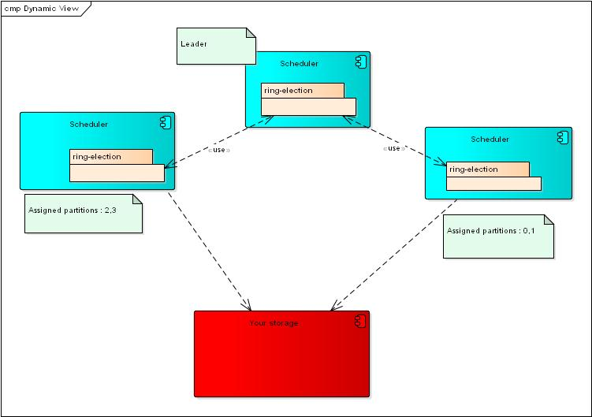
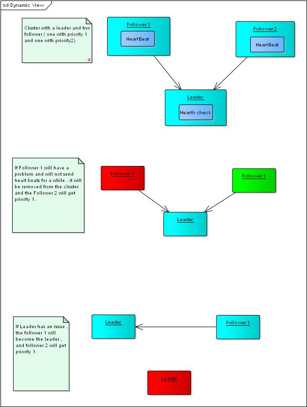

# Ring election
[](https://coveralls.io/github/pioardi/ring-election?branch=master)
[](https://travis-ci.org/pioardi/ring-election)
[](https://www.codacy.com/app/alessandroardizio94/ring-election?utm_source=github.com&amp;utm_medium=referral&amp;utm_content=pioardi/ring-election&amp;utm_campaign=Badge_Grade)


<h2>Contents</h2>
<a href="#overview">Overview</a><br>
<a href="#examples">Examples </><br>
<a href="#config">Config</a><br>
<a href="#monitoring">Monitoring</a><br>
<a href="#todo">Vision</a><br>
<a href="#hld">High level design</a><br>


<h2 id="overview">Overview and rationale</h2>
In modern systems it is often needed to distribute the application load to make the system scalable so that every data is processed by a single instance. <br>
Ring-election is a driver that implements a distributed algorithm that assigns to each node the partitions to work on .
In a simple use case each node can obtain data that are part of the partitions of which it is owner and work on them. <br>
The algorithm will assign to each node one or more partitions to work with.<br>
A node will be removed if it does not send an hearth beat for a while , this process is called heart check.<br>
Each node in the ring will have an ID and a priority , if the leader node will die the node with lower priority will be elect as leader. <br>
If a node is added or removed from the cluster, the allocated partitions will be rebalanced.

<strong>What the ring-election driver offers you ?</strong><br>

- A default partitioner that for an object returns the partition to which it is assigned.<br>
- Mechanism of leader election<br>
- Failure detection between nodes.<br>
- Assignment and rebalancing of partitions between nodes<br>
- Automatic re-election of the leader<br>

<strong>What problems can you solve with this driver ?</strong><br>
- Scalability<br>
- High availability<br>
- Concurrency between nodes in a cluster<br>
- Automatic failover<br>

<strong>Use cases</strong>

<strong>Distributed Scheduler</strong><br>
Each Scheduler instance will work on the assigned partitions .<br>



<h2>Examples</h2>
<strong>How to leader</strong><br>

```javascript
const ring = require('ring-election');
ring.leader.createServer();
// to get ring info
ring.leader.ring();
// Your leader will be the coordinator.
```
<strong>How to follower</strong><br>

```javascript
const ring = require('ring-election');
ring.follower.createClient();
// to get ring info
ring.follower.ring();
// to get assigned partitions
let assignedPartitions = ring.follower.partitions();
// now let me assume that a follower will create some data
// and you want to partition this data
let partition = ring.follower.defaultPartitioner('KEY');
// save your data including the partition on a storage
// you will be the only one in the cluster working on the partitions assigned to you.
```

<strong> Try it out ! </strong>
```bash
   docker image build -t ring-election .
   docker-compose up
```

 
See examples folder for more advanced examples


<h2 id="config"> Configuration </h2>
 PORT : The leader will start to listen on this port , default is 3000 <br>
 TIME_TO_RECONNECT: The time to wait for a follower when he has to connect to a new leader in ms , default is 3000 <br>
 HEARTH_BEAT_FREQUENCY: The frequency with which a hearth beat is performed by a follower , default is 1000 <br>
 HEARTH_BEAT_CHECK_FREQUENCY: The frequency with which an hearth check is performed by a leader , default is 3000 <br>
 LOG_LEVEL: Follow this https://www.npmjs.com/package/winston#logging-levels , default is info.<br>
 NUM_PARTITIONS: Number of partitions to distribute across the cluster , default is 10. <br>
 SEED_NODES : hostnames of leader node comma separated, default is localhost <br>
 MONITORING_PORT : port to expose rest service for monitoring , default is 9000<br>

<h2 id="monitoring"> Monitoring API </h2>
To monitor your cluster contact any node on the path /status (HTTP verb :  GET) or contact a follower node on /partitions (HTTP verb :  GET). <br>


<h2 id="todo">TODO List </h2>
Tag 1.0 and public on npm<br>
Document use cases <br>
Re-add a client in the cluster when it was removed and send an hearth beat <br>
Retry leader reconnection <br>
Tag 1.1 and public on npm<br>

<h2 id="hld">High Level Diagram</h2>




